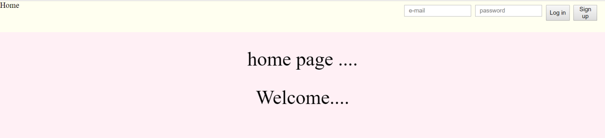
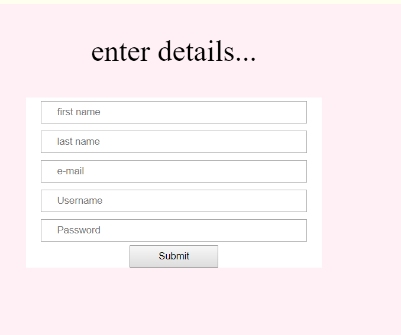
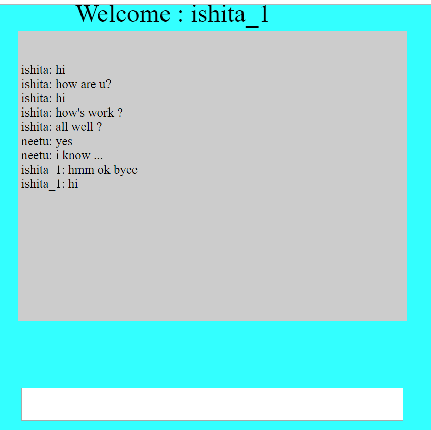
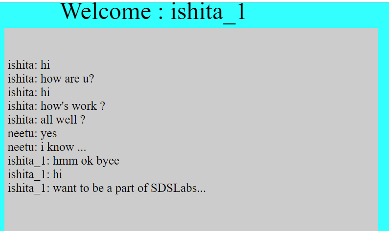

# login-system
Login and Messaging system that helps to send messages in group chat.

Chat Application:
This is an application for group chat which has a sign-up page, a login page and a welcome page.
You can send and receive messages by this app. This allows all registered users to communicate with each other by putting forward their views and viewing the opinions of other members.
Build Instructions:
1)	Install Xampp by following the given link:
https://www.wikihow.com/Install-XAMPP-for-Windows
2)	Create a database in phpMyAdmin by following the code in dump.sql file attached to the project.
3)	Open the Xampp Control Panel and start Apache and MySQL and then the chat App would be working.
4)	Please remember to put your folder containing all the files in the htdocs folder in Xampp in C drive.
5)	Open the project in localhost.

How I made the project:
1)	First I made a basic layout of the sign-up and login page with a basic HTML and CSS layout.
2)	I created a database(test) in phpMyAdmin and then created a table named as ‘users’.
3)	Then I connected the database to the sign-up page and sent all information from sign-up page to the database after checking through the error handlers.
4)	Thereafter I connected the database to the login page. Every time the user requests for the sign-in his information is checked from database and only if it matches i.e. is verified, he is directed to the welcome page.
5)	Each time the user logs in, all the previous chats are loaded from the database ‘chat’(Another table I created in the database) and if the user enters something new then it also gets appended to the field message in the table ‘chat’.
6)	Then finally I created the logout button which takes user back to the Log-in or Home page.

Screen-shots of the project :
 

 
 
Added a new message:--

 

